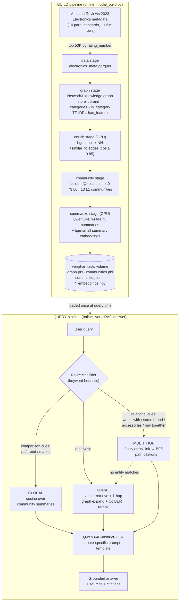

# VERGIL — GraphRAG over a Product Knowledge Graph

VERGIL is a **Graph-enhanced Retrieval-Augmented Generation** system for e-commerce
product discovery and Q&A. It builds a **product knowledge graph** from Amazon Reviews
2023 (Electronics) metadata, runs **Microsoft-style GraphRAG** (graph construction →
Leiden community detection → hierarchical LLM community summaries), and answers questions
through **three routed retrieval modes** — `local`, `global`, and `multi_hop` — with a
**Qwen3-4B-Instruct-2507** generator that produces grounded answers **with provenance
citations**, including multi-hop reasoning paths that plain vector RAG structurally cannot
produce.

The headline: a **65,570-node / 569,734-edge** knowledge graph, **73** Leiden communities
with LLM-written summaries, and a router that picks between vector retrieval, market-level
community synthesis, and path-cited graph traversal.

### What GraphRAG buys you over vanilla RAG

Vanilla vector RAG chunks documents, embeds them, and retrieves the top-k nearest chunks.
That works well for *"find me a product like this"* but has two structural blind spots:

- **No aggregation.** Ask *"what are the trends in wireless audio?"* and there is no single
  chunk that contains a market-level synthesis — the answer has to be *composed* from
  hundreds of products. GraphRAG precomputes exactly that as **community summaries**.
- **No relational reasoning.** Ask *"what accessories from the same brand pair with this?"*
  and vector similarity cannot walk a `brand → sibling-products` relationship. GraphRAG
  answers it by **traversing the graph** and returns the traversal path as a citation.

VERGIL keeps a vanilla vector pipeline alongside the graph pipeline so the difference is
demonstrable, not asserted (see [Evaluation](#evaluation--graphrag-vs-vanilla-rag)).

VERGIL is **standalone** — it brings its own embedding model (`BAAI/bge-small-en-v1.5`) for
similarity edges + community search and its own ColBERT reranker for product retrieval. It
has **zero dependency on any sibling project**; a downstream consumer can inject a stronger
fine-tuned bi-encoder via the `encoder=` argument.

---

## The knowledge graph (full 50K-product build)

| | |
|---|---|
| **Nodes** | **65,570** — product 50,000 · brand 10,051 · feature 4,722 · category 797 |
| **Edges** | **569,734** — has_feature 249,484 · in_category 209,289 · similar_to 60,962 · has_brand 49,999 |
| **Communities** | **73** at level 0, **13** at level 1 (Leiden, resolution 4.0) |
| **Avg product degree** | 12.61 |
| **Largest community** | 3,161 products = 6.3% of 50K (well-distributed, no mega-blob) |
| **Generator** | `Qwen/Qwen3-4B-Instruct-2507` (Apache-2.0, non-thinking) |
| **Encoder** | `BAAI/bge-small-en-v1.5` (similarity edges + community search) |

Edges are derived from structured metadata (`store` → brand, `categories`, `features` via
TF-IDF keywords) plus a `bge-small` k-NN `similar_to` layer. Amazon-2023's `bought_together`
field is empty in the public release, so co-purchase edges are not used — an honest
data-reality call; the `similar_to` layer plays the "related products" role instead (see
[Engineering journey](#engineering-journey--what-we-tried)).

---

## Architecture

VERGIL has two pipelines: an **offline BUILD** pipeline that constructs the graph and the
GraphRAG index once, and an **online QUERY** pipeline that routes each question to the right
retrieval mode and generates an answer.



### BUILD pipeline, stage by stage

1. **`data` (CPU).** Downloads the Amazon Reviews 2023 Electronics metadata directly from
   the 10 published parquet shards (~1.6M raw products), filters to rows with a title and a
   review count, and keeps the **top 50,000 by `rating_number`** (most-reviewed = highest
   signal). Written as `electronics_meta.parquet`.

2. **`graph` (CPU).** Builds the NetworkX knowledge graph from structured metadata:
   `store` → **brand** nodes (canonicalized to dedup storefront fragments like *"Visit the X
   Store"*), `categories` → **category** nodes via `in_category` edges, and a TF-IDF pass
   over product text → **feature** nodes via weighted `has_feature` edges. Result at 50K:
   **65,570 nodes**.

3. **`enrich` (GPU).** Encodes product descriptions with `bge-small-en-v1.5`, runs a FAISS
   k-NN, and adds a **`similar_to`** edge between products whose cosine similarity ≥ 0.85.
   This is the "related products" layer (60,962 edges). A connectivity audit confirms the
   **largest connected component = 100% of nodes** — the graph is well-connected despite the
   absent co-purchase data.

4. **`community` (CPU).** Runs **weighted Leiden** community detection via `leidenalg`
   directly (`RBConfigurationVertexPartition`, `resolution=4.0`, `seed=42`) to get **73
   level-0 communities**, then contracts to a community-graph and re-clusters at half
   resolution for **13 level-1** super-communities. An anti-blob guard re-runs at 2×
   resolution if any single community swallows >40% of the graph.

5. **`summarize` (GPU).** For each of the 73 communities, samples representative products
   and their top brands and has **Qwen3-4B-Instruct-2507** write a short market-level
   summary (e.g. *"wireless and wired headphones and earbuds … TOZO, Panasonic, OnePlus"*).
   Communities with <3 products get a deterministic stub instead of an LLM hallucination.
   Each summary is embedded with `bge-small` → `summary_embeddings.npy`. This is the artifact
   that powers **global search**.

All five stages are idempotent, write to the `vergil-artifacts` Modal volume, and read the
previous stage's output — so a failure re-runs one `--stage`, never from zero.

### QUERY pipeline, stage by stage

1. **Route classifier.** `VergilRAG._classify_query` is a fast keyword heuristic:
   comparison/aggregation cues (`vs`, `trend`, `market`, `overview`, `popular`) → **global**;
   relational cues (`works with`, `same brand`, `accessories`, `buy together`, `pairs with`)
   → **multi_hop**; everything else → **local**. (A future LLM classifier would handle
   ambiguous queries; the heuristic avoids an extra LLM call and scores 10/12 on the eval.)

2. **Retrieve** in the selected mode (detailed below). Multi-hop **degrades gracefully**: if
   entity linking matches no graph node, it falls back to local search and flags
   `fallback: true`.

3. **Generate.** The retrieved context fills a route-specific prompt template
   (`LOCAL_QA_PROMPT` / `GLOBAL_QA_PROMPT` / `MULTI_HOP_QA_PROMPT`) and Qwen3-4B produces the
   answer (temp ~0.1, up to 600 tokens). The return payload carries `answer`, `query_type`,
   `sources`, `retrieval_method`, and `fallback`.

---

## The three retrieval modes

### Local search — specific product queries

*Example: "4K webcam for streaming"* or *"noise cancelling headphones under $200"*.

1. The vector index retrieves the **top-50 products** by embedding similarity.
2. Each hit is **expanded 1 hop** through the graph: `similar_to` neighbors (bonus +0.15),
   same-brand siblings reached *through the brand node* (bonus +0.10, capped at 10 per brand
   so mega-brands don't flood the pool), and `bought_together` neighbors (+0.30, high signal
   but rare here).
3. Scoring blends the vector cosine with the best edge bonus; a graph-only discovery inherits
   its seed's score at a 0.5 discount so it can rank but never dominate the seed that
   surfaced it.
4. The pooled candidates go through a **ColBERT reranker** (`rerankers` 0.10.0), with an
   identity fallback if the reranker fails.

This is the mode where GraphRAG and vanilla RAG are *closest* — the graph expansion adds
same-brand / similar siblings a pure top-k retrieve would miss, but both return sensible
answers.

### Global search — market synthesis

*Example: "What are the trends in wireless audio?"* or *"Compare audio brands in the
mid-range segment"*.

This is the thing vanilla vector RAG **cannot do**. There is no single chunk that contains a
market-level synthesis, so vanilla can only quote the few product chunks it happened to
retrieve. VERGIL instead embeds the query and runs **cosine similarity over the 73
community-summary embeddings**, returning the most relevant clusters with their key brands
and sample products. The answer is grounded in a synthesis that spans hundreds of products
per community.

### Multi-hop search — path-cited relational reasoning

*Example: "What's the cheapest product from the same brand that has noise cancelling?"*

1. **Entity linking:** `rapidfuzz` token-set-ratio (≥80) against product + brand node names,
   preferring exact substring hits (model numbers, brands). Matches are capped so a generic
   entity can't seed the whole catalog.
2. **Hub-guarded BFS** (≤2 hops) from the matched seeds — the hub-guard caps neighbors per
   node so brand/category hubs don't explode.
3. **Score** the discovered products against the query (embedding cosine when a vector index
   is passed, else fuzzy name match).
4. **Attach a citation path** — the human-readable shortest path from each product's closest
   seed. *This path is the reasoning chain*, and it is exactly what vanilla RAG structurally
   cannot produce.

#### Flagship example — *"What accessories from Sony are compatible with the WH-1000XM5?"*

- **Vanilla RAG:** *"There are no accessories listed in the provided product information
  that are specifically compatible with the Sony WH-1000XM5…"* — a dead end.
- **VERGIL (multi_hop):** entity-links **Sony** + **WH-1000XM5**, traverses the graph, and
  returns discovered products **with the paths that found them**:

  ```
  Sony --[has_brand]--> Sony WH-1000XM4 Wireless Noise Cancelling Headphones
  Sony --[has_brand]--> Sony WH-1000X Noise Cancelling Headphones
  Sony --[has_brand]--> Sony MDREX14AP In-Ear Earbud Headphones
  ```

  Crucially, VERGIL is **honest about the graph's limits** — it states the KG has no explicit
  `compatible_with` edges (only `has_brand` / `has_feature` / `in_category` / `similar_to`),
  so it surfaces same-brand candidates *rather than hallucinating* a compatibility claim the
  graph can't support. Surfacing the provenance path is what lets it be honest: you can see
  exactly *why* each product was returned.

---

## Evaluation — GraphRAG vs vanilla RAG

The `rag_eval` stage runs 12 hand-authored queries (3 local / 4 global / 5 multi_hop) through
**both** a vanilla vector-only pipeline and the routed VERGIL pipeline, with the **generator
held constant** so the only variable is retrieval.

**Routing accuracy: 10/12 (83%)** — local 3/3, global 4/4, multi_hop 3/5. The two multi_hop
"misses" are defensible label calls: an attribute-filter query correctly routed to local, and
a *"JBL vs Sonos"* query routed to global on the comparison cue.

Both pipelines return non-empty, cited answers on every query, so the differentiator is
**capability and provenance, not a scalar score** (there is no LLM-judge — grade the
side-by-side manually):

- **Global queries:** VERGIL grounds the answer in community summaries spanning hundreds of
  products; vanilla can only quote whatever few chunks it retrieved.
- **Multi_hop queries:** VERGIL returns **graph path citations** (`Sony --[has_brand]--> …`)
  that vanilla structurally cannot produce.

Latency: vanilla ~10–20 s, VERGIL ~22–25 s (graph traversal + expansion adds a few seconds;
this is an accuracy/provenance-over-speed design). The eval is deliberately small (12 queries,
no LLM-judge) — see [Limitations](#limitations--production-notes).

---

## Engineering journey — what we tried

This section is the honest record of what broke, what we tried, and what we shipped.

### Data reality: the empty `bought_together` field

The original design leaned on **co-purchase edges** (`bought_together` / `also_buy`) as the
highest-signal "related products" relationship. Auditing the actual Amazon-2023 Electronics
release showed those fields are **empty in the public data** — so co-purchase edges are
impossible to build. Rather than fake them, we made the `similar_to` layer (bge-small k-NN,
60,962 edges) play the "related products" role, and left the `bought_together` scoring bonus
(+0.30) in place for any future dataset that *does* populate the field. Separately, the
Amazon-2023 **HF loading script is dead on `datasets` ≥ 4** (it removed `trust_remote_code`),
so we load the published **parquet shards directly** instead.

### Community detection: from mega-blobs to 73 balanced clusters

The first full 50K build ran Leiden at **resolution 1.0** and produced **25 mega-communities**
— the largest was **8,187 products (16% of the catalog)**, a "tablet accessories" blob too
coarse for useful global-search summaries. The dense feature/category graph (avg degree ~15)
pushes Leiden toward a few giant clusters at low resolution. We **raised the resolution to
4.0** and re-ran only the (cheap, CPU) `community` stage plus the `summarize` stage — no graph
rebuild — yielding **73 balanced communities** with the largest at **3,161 products (6.3%)**.
Summary quality went from an 8,187-product blob to specific clusters like *"wireless and wired
headphones and earbuds … TOZO, Panasonic, OnePlus"*. We also learned that **cdlib's
`leiden()` wrapper rejects `seed=`** on the installed version, so we call **`leidenalg`
directly** (`RBConfigurationVertexPartition`) for stable weighted + resolution + seed control.

### Generator: Qwen2.5-7B → Qwen3-4B-Instruct-2507

The build originally used `Qwen2.5-7B-Instruct`. We swapped to
**`Qwen/Qwen3-4B-Instruct-2507`**: Apache-2.0 and ungated, natively **non-thinking** (no
`<think>` blocks or `enable_thinking` flag to manage), supported by `transformers` ≥ 4.51 (so
it fits the pinned 4.57.6), and benchmarking **at or above Qwen3-8B and above Qwen2.5-7B while
using ~half the VRAM** (~2.5 GB as a Q4 GGUF — a real win for the Kaggle-T4 inference story).
The community summaries were **regenerated** with it before the final eval.

Two later upgrades: the summaries were regenerated **again with Qwen3-30B-A3B-Instruct-2507**
(via `modal_build.py --stage summarize --llm-model …` — the MoE fits an A100-80GB in bf16 and
markedly enriches the market-analysis prose that global search reads), and `QwenLLM` gained a
third **`backend="vllm"`** (AsyncLLMEngine bridged behind the same sync
`generate`/`generate_stream` API). HF `.generate()` decoded the 30B-A3B at ~6 tok/s; vLLM
with CUDA graphs does **~115 tok/s** — this is what SPARDA's deployed demo serves with.

### Routing fix: keyword matching that actually matches

The first eval run routed only **1 of 5** multi_hop queries correctly. The keyword router was
too literal: it looked for `"from same brand"` but the query said *"from **the** same
brand"*, and it looked for `"bought together"` but the query said *"buy together"*. We
broadened the keyword set (`same brand`, `buy together`, `work with`, `frequently bought`,
`pairs with`, …), lifting **multi_hop routing 1/5 → 3/5** and overall routing to **10/12**.
The two remaining misses are defensible label calls, not bugs (attribute-filter → local; a
"vs" comparison → global).

**Round 2 — the opposite failure mode.** Broad keywords over-matched: raw substring
containment meant `"vs"` fired inside **"tvs"**, silently misrouting *"best 4K TVs under
$500"* to global community search. The fix matches single keywords against whole **tokens**
and stems (`trend*`, `compatib*`) against token substrings, keeping multi-word phrases as
plain containment — 13/13 routing checks pass with every intended route preserved. (A
matching audit fix: `_extract_entities` now guards valid-but-non-list LLM JSON — a bare
`"Sony"` used to be iterated downstream into `['S','o','n','y']` — and entity linking uses a
per-graph cached name index instead of re-scanning all ~65K nodes per entity per query.)

### Stack alignment: making the ColBERT reranker work

The runtime layer needs the ColBERT reranker (`rerankers[transformers]` 0.10.0), and the
**5.x `transformers` line removed the internals it hooks**. We moved the whole project onto a
validated **4.x stack** (`transformers` 4.57.6 / `sentence-transformers` 4.1.0 /
`rerankers` 0.10.0 / `numpy` 2.2.6). Qwen3-4B works unchanged on this pin, and
`from_pretrained(dtype=...)` is the correct (non-deprecated) kwarg there.

### Earlier hardening (V1 audit)

Before any GPU run, a read-only audit caught and fixed: an **O(N²) membership check** inside
the graph-build loop (fixed with a precomputed `set`), **brand dedup** for storefront
fragments, a **CUDA-OOM retry** on the encode batch, **weight-blind / non-reproducible
Leiden** calls (added `weights` + `seed`), and an **LLM-hallucination guard** for tiny
communities. Two runtime bugs surfaced during the CPU smoke: parquet **list columns**
returning numpy arrays that broke `if features:` truthiness (fixed with a list normalizer),
and the cdlib `seed=` rejection above.

---

## How to run

`modal_build.py` is a **fully isolated** Modal job — its own app (`vergil-build`) and volume
(`vergil-artifacts`), **no secrets, no database, no shared state**. Nothing is *trained*
(VERGIL has no trainable model); the GPU stages are short inference bursts (bge-small encoding,
Qwen3-4B writing summaries).

```bash
pip install modal && modal token new              # one-time auth

modal run modal_build.py --stage all --limit 2000 # quick smoke test
modal run modal_build.py --stage all              # full 50K build
```

Stages run in order, each reading the previous stage's output from the volume:
`data` (CPU) → `graph` (CPU) → `enrich` (GPU) → `community` (CPU) → `summarize` (GPU). Run one
at a time with `--stage <name>`. The GraphRAG-vs-vanilla ablation is a separate stage (it needs
extra A100 minutes), run explicitly after the build:

```bash
modal run --detach modal_build.py --stage rag_eval
```

Pull artifacts off the volume (then push to HF Hub / Kaggle, not git):

```bash
modal volume get vergil-artifacts /graph.pkl              ./artifacts/graph.pkl
modal volume get vergil-artifacts /communities.pkl        ./artifacts/communities.pkl
modal volume get vergil-artifacts /summaries.json         ./artifacts/summaries.json
modal volume get vergil-artifacts /summary_embeddings.npy ./artifacts/summary_embeddings.npy
modal volume get vergil-artifacts /rag_eval.json          ./artifacts/rag_eval.json
```

Clean up (only touches this volume): `modal volume delete vergil-artifacts`.

### Install as a library

```bash
pip install git+https://github.com/DestroyorahSignus/vergil.git
```

---

## Limitations / production notes

- **Graph backend.** VERGIL uses **NetworkX in-memory**, which is the right call at the
  50K-product demo scale. For production you would move the graph backend to **Neo4j** or
  **Amazon Neptune**; the rest of the architecture (vector index + community summaries + LLM)
  is unchanged.
- **Eval scope.** The evaluation is a small **12-query** hand-authored set with **no
  LLM-judge** — enough to demonstrate routing and the capability gap, not to produce a
  robust scalar. A larger judged eval is future work.
- **Router.** The route classifier is a keyword heuristic. It scores 10/12 here but an LLM
  classifier would handle genuinely ambiguous queries better.
- **No compatibility edges.** The KG has no explicit `compatible_with` relationship (the
  source data doesn't provide one), so multi_hop compatibility queries return same-brand
  candidates and say so, rather than inventing compatibility.
- **Optional future work.** Regenerate the community summaries with a larger model for
  richer global-search context; populate co-purchase edges if a dataset with real
  `bought_together` data is used.
