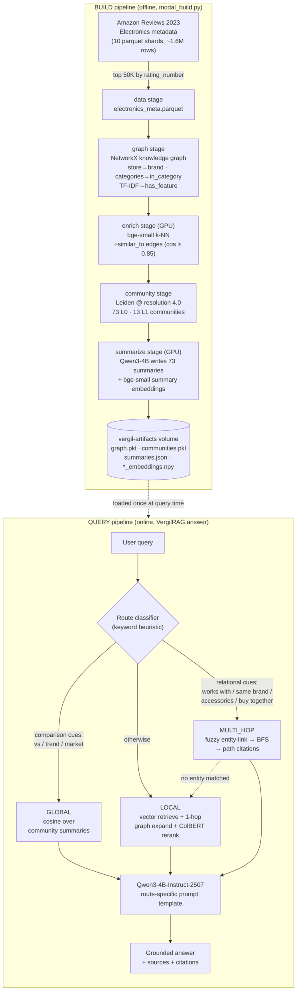

# VERGIL — GraphRAG over a Product Knowledge Graph

VERGIL is a **Graph-enhanced Retrieval-Augmented Generation** system for e-commerce
product discovery and Q&A. It builds a **product knowledge graph** from Amazon Reviews
2023 (Electronics) metadata, runs **Microsoft-style GraphRAG** (graph construction →
Leiden community detection → hierarchical LLM community summaries), and answers questions
through **three routed retrieval modes** — `local`, `global`, and `multi_hop` — with a
**Qwen3-4B-Instruct-2507** generator that produces grounded answers **with provenance
citations**, including multi-hop reasoning paths that plain vector RAG structurally cannot
produce.

The headline: a **65,570-node / 569,734-edge** knowledge graph, **73** Leiden communities
with LLM-written summaries, and a router that picks between vector retrieval, market-level
community synthesis, and path-cited graph traversal.

### What GraphRAG buys you over vanilla RAG

Vanilla vector RAG chunks documents, embeds them, and retrieves the top-k nearest chunks.
For a product catalog, "documents" are per-product description blobs, so retrieval can
only ever return *a handful of individual products that look like the query*. That works
well for *"find me a product like this"* but has two structural blind spots:

- **No aggregation.** Ask *"what are the trends in wireless audio?"* and there is no single
  chunk that contains a market-level synthesis — the answer has to be *composed* from
  hundreds of products. GraphRAG precomputes exactly that as **community summaries**.
- **No relational reasoning.** Ask *"what accessories from the same brand pair with this?"*
  and vector similarity cannot walk a `brand → sibling-products` relationship. GraphRAG
  answers it by **traversing the graph** and returns the traversal path as a citation.

Both blind spots share a root cause: embedding similarity measures *how alike two texts
are*, not *how two things are connected*. A charging case looks nothing like the headphones
it goes with — no embedding places them next to each other — but on the graph they are two
hops apart through the shared brand node. The knowledge graph buys you exactly two things
vector search cannot represent:

1. **Multi-hop paths** — explicit, walkable relationships (`product → brand → sibling
   product`, `product → similar_to → product`), each hop typed and citable. This is what
   the `multi_hop` mode traverses, and why its answers ship with `A --[has_brand]--> B`
   reasoning chains.
2. **Community-level structure** — densely connected clusters of the graph, detected once
   with Leiden and summarized once with an LLM. A question that spans hundreds of products
   ("compare audio brands in the mid-range segment") is answered from a handful of
   precomputed cluster summaries instead of a lucky top-k of product chunks. This is what
   the `global` mode retrieves over.

The third mode, `local`, is where the two systems meet: it is vector retrieval *plus* a
1-hop graph expansion, so even ordinary product searches pick up same-brand and
similar-to siblings that pure top-k would miss. The 12-query evaluation set is built
around exactly this split (3 local / 4 global / 5 multi_hop), and the flagship multi-hop
example below shows the failure mode concretely: vanilla RAG answers *"there are no
accessories listed"* while VERGIL walks the brand node and cites the paths it took.

VERGIL keeps a vanilla vector pipeline alongside the graph pipeline so the difference is
demonstrable, not asserted (see [Evaluation](#evaluation--graphrag-vs-vanilla-rag)).

VERGIL is **standalone** — it brings its own embedding model (`BAAI/bge-small-en-v1.5`) for
similarity edges + community search and its own ColBERT reranker for product retrieval. It
has **zero dependency on any sibling project**; a downstream consumer can inject a stronger
fine-tuned bi-encoder via the `encoder=` argument.

---

## The knowledge graph (full 50K-product build)

| | |
|---|---|
| **Nodes** | **65,570** — product 50,000 · brand 10,051 · feature 4,722 · category 797 |
| **Edges** | **569,734** — has_feature 249,484 · in_category 209,289 · similar_to 60,962 · has_brand 49,999 |
| **Communities** | **73** at level 0, **13** at level 1 (Leiden, resolution 4.0) |
| **Avg product degree** | 12.61 |
| **Largest community** | 3,161 products = 6.3% of 50K (well-distributed, no mega-blob) |
| **Generator** | `Qwen/Qwen3-4B-Instruct-2507` (Apache-2.0, non-thinking) |
| **Encoder** | `BAAI/bge-small-en-v1.5` (similarity edges + community search) |

Edges are derived from structured metadata (`store` → brand, `categories`, `features` via
TF-IDF keywords) plus a `bge-small` k-NN `similar_to` layer. Amazon-2023's `bought_together`
field is empty in the public release, so co-purchase edges are not used — an honest
data-reality call; the `similar_to` layer plays the "related products" role instead (see
[Engineering journey](#engineering-journey--what-we-tried)).

---

## Dataset reality — Amazon Reviews 2023, as it actually is

The source is McAuley Lab's **Amazon Reviews 2023** (`McAuley-Lab/Amazon-Reviews-2023` on
Hugging Face): 48.19M items, 571.54M reviews, 33 categories, CC0 license. VERGIL uses the
**metadata** of exactly one category — `raw_meta_Electronics`, ~1.6M products (the full
build counted **1,610,012 raw rows**) — and never touches the review text: the graph is
built from structured product fields, not noisy review prose.

Two audit findings (2026-06-26, on a 3,000-row sample of the real shards) shaped the whole
design:

**1. The HF loading script is dead.** `datasets>=4` removed `trust_remote_code`, and the
dataset repo's loader script depends on it — so the canonical
`load_dataset("McAuley-Lab/Amazon-Reviews-2023", "raw_meta_Electronics", trust_remote_code=True)`
simply errors. VERGIL therefore loads the **published parquet shards directly**: 10 files
named `full-0000{i}-of-00010.parquet` (~161K rows each) read via
`load_dataset("parquet", data_files=[hf://...], split="train")`, which works on any
`datasets` version with no remote code.

**2. Co-purchase data does not exist in this release.** `bought_together` is **0% populated**
(empty on every sampled row), and the `also_buy` / `also_view` columns **do not exist in
the 2023 schema at all**. The original design leaned on co-purchase as the highest-signal
"related products" edge; the audit made that impossible, which **forced the edge schema onto
what the data actually provides**: `has_brand` + `in_category` + `has_feature` +
a computed `similar_to` embedding layer. The co-purchase edge types remain in the schema
(and in the graph-build loops) for forward-compatibility, but they build zero edges here.

The actual 2023 metadata schema, with audited field population:

| Field | Population | Used for |
|---|---|---|
| `title`, `parent_asin`, `rating_number` | 100% | product node id/name, subsample ranking |
| `details` (dict: Brand/Manufacturer/…) | 100% | brand extraction (first choice) |
| `store` | 99.4% | brand extraction (fallback) |
| `categories` (list of path-lists) | 92.7% | category nodes + `category_parent` chains |
| `features` (bullet points) | 78.8% | description blob + TF-IDF feature terms |
| `description` | 57.1% | description blob (truncated) |
| `bought_together` | **0% (always empty)** | nothing — loops are no-ops by design |
| `also_buy` / `also_view` | **absent from schema** | nothing |

**The 50K subsample.** Graphing all ~1.6M products is neither feasible nor useful for a
demo-scale system, so the `data` stage filters to rows with a title and a `rating_number`,
then keeps the **top 50,000 by `rating_number`**. The rationale: most-reviewed products are
the most-connected ones (popular brands, dense categories), so ranking by review count
yields the densest, most interesting subgraph that still processes in minutes. The
connectivity audit after the enrich stage vindicated this: the **largest connected component
covers 100% of nodes** even without any co-purchase edges.

One implementation gotcha worth recording: parquet **list columns** (`features`,
`categories`, `description`, `bought_together`) come back as numpy arrays, and
`if features:` / `field or []` on a numpy array raises *"truth value of an array is
ambiguous"*. Every list-shaped field is funneled through an `_as_list()` normalizer in
`vergil/data/build_graph.py` before use — this was one of the two runtime bugs found in the
CPU smoke test.

---

## Architecture

VERGIL has two pipelines: an **offline BUILD** pipeline that constructs the graph and the
GraphRAG index once, and an **online QUERY** pipeline that routes each question to the right
retrieval mode and generates an answer.



### BUILD pipeline, stage by stage

1. **`data` (CPU).** Downloads the Amazon Reviews 2023 Electronics metadata directly from
   the 10 published parquet shards (~1.6M raw products), filters to rows with a title and a
   review count, and keeps the **top 50,000 by `rating_number`** (most-reviewed = highest
   signal). Written as `electronics_meta.parquet`.

2. **`graph` (CPU).** Builds the NetworkX knowledge graph from structured metadata:
   `store` → **brand** nodes (canonicalized to dedup storefront fragments like *"Visit the X
   Store"*), `categories` → **category** nodes via `in_category` edges, and a TF-IDF pass
   over product text → **feature** nodes via weighted `has_feature` edges. Result at 50K:
   **65,570 nodes**.

3. **`enrich` (GPU).** Encodes product descriptions with `bge-small-en-v1.5`, runs a FAISS
   k-NN, and adds a **`similar_to`** edge between products whose cosine similarity ≥ 0.85.
   This is the "related products" layer (60,962 edges). A connectivity audit confirms the
   **largest connected component = 100% of nodes** — the graph is well-connected despite the
   absent co-purchase data.

4. **`community` (CPU).** Runs **weighted Leiden** community detection via `leidenalg`
   directly (`RBConfigurationVertexPartition`, `resolution=4.0`, `seed=42`) to get **73
   level-0 communities**, then contracts to a community-graph and re-clusters at half
   resolution for **13 level-1** super-communities. An anti-blob guard re-runs at 2×
   resolution if any single community swallows >40% of the graph.

5. **`summarize` (GPU).** For each of the 73 communities, samples representative products
   and their top brands and has **Qwen3-4B-Instruct-2507** write a short market-level
   summary (e.g. *"wireless and wired headphones and earbuds … TOZO, Panasonic, OnePlus"*).
   Communities with <3 products get a deterministic stub instead of an LLM hallucination.
   Each summary is embedded with `bge-small` → `summary_embeddings.npy`. This is the artifact
   that powers **global search**.

All five stages are idempotent, write to the `vergil-artifacts` Modal volume, and read the
previous stage's output — so a failure re-runs one `--stage`, never from zero.

### QUERY pipeline, stage by stage

1. **Route classifier.** `VergilRAG._classify_query` is a fast keyword heuristic:
   comparison/aggregation cues (`vs`, `trend`, `market`, `overview`, `popular`) → **global**;
   relational cues (`works with`, `same brand`, `accessories`, `buy together`, `pairs with`)
   → **multi_hop**; everything else → **local**. (A future LLM classifier would handle
   ambiguous queries; the heuristic avoids an extra LLM call and scores 10/12 on the eval.)

2. **Retrieve** in the selected mode (detailed below). Multi-hop **degrades gracefully**: if
   entity linking matches no graph node, it falls back to local search and flags
   `fallback: true`.

3. **Generate.** The retrieved context fills a route-specific prompt template
   (`LOCAL_QA_PROMPT` / `GLOBAL_QA_PROMPT` / `MULTI_HOP_QA_PROMPT`) and Qwen3-4B produces the
   answer (temp ~0.1, up to 600 tokens). The return payload carries `answer`, `query_type`,
   `sources`, `retrieval_method`, and `fallback`.

---

## Graph construction in depth

The graph is a heterogeneous undirected `networkx.Graph` with four node types and (in
practice, on this dataset) four live edge types. The attribute schema per node type:

| Node type | Node id | Attributes |
|---|---|---|
| **product** (50,000) | `parent_asin` | `type`, `name` (title), `description` (title + top-5 feature bullets + description truncated to 500 chars), `price`, `rating` |
| **brand** (10,051) | `brand:<canonical-key>` | `type`, `name` (prettiest display form seen) |
| **category** (797) | `cat:<lowercased-name>` | `type`, `name` |
| **feature** (4,722) | `feat:<term>` | `type`, `name` |

| Edge type | Count (50K build) | Built from | Weight |
|---|---|---|---|
| `has_feature` | 249,484 | TF-IDF top terms per product | TF-IDF score |
| `in_category` | 209,289 | `categories` path-lists | 1.0 |
| `similar_to` | 60,962 | bge-small k-NN over descriptions | cosine similarity |
| `has_brand` | 49,999 | `details.Brand` / `details.Manufacturer` / `store` | 1.0 |
| `category_parent` | (hierarchy chains within `categories` paths) | consecutive path entries | 1.0 |
| `bought_together` / `also_bought` | **0 — fields empty/absent in Amazon-2023** | kept for forward-compat | — |

Construction details that matter:

- **Brand canonicalization.** Amazon's brand fields are dirty — "Sony", "Visit the Sony
  Store", "by Sony" all mean Sony, and without dedup the `has_brand` edges never connect
  same-brand products (which would silently kill the multi-hop demo). `_canon_brand` strips
  storefront cruft (`Visit the …`, trailing `… Store`, leading `by `), lowercases, and
  collapses whitespace to form the node **key**; the human-readable **display name** is kept
  separately, preferring the shortest form seen.
- **Feature extraction.** A `TfidfVectorizer` (`max_features=5000`, English stop words,
  1–2-gram) runs over each product's description blob; the **top 5 terms per product**
  become feature nodes with the TF-IDF score as edge weight. This replaces the pricier
  KeyBERT/LLM options — features are enrichment, and the graph still walks on
  brand + category + similar_to if this layer is thin.
- **`similar_to` edges (the enrich stage).** Every product description is encoded with
  `bge-small-en-v1.5` (384-dim, L2-normalized, `batch_size=256` with a one-shot CUDA-OOM
  retry at 64), indexed in a `faiss.IndexFlatIP` (inner product == cosine on normalized
  vectors), and queried for its **top-5 nearest neighbors** (+1 for self). An edge is added
  only when **cosine ≥ 0.85** *and* the neighbor is a **different brand** — same-brand
  connections already exist through the brand node, and the cross-brand rule is one of the
  guards that stops `similar_to` from densifying the graph into a single Leiden mega-blob.
  Edge weight = the cosine, so traversal and community detection can prefer stronger
  semantic links.
- **O(N) membership, not O(N²).** The per-row loops check related ASINs against a
  precomputed `set(meta_df["parent_asin"])`; the naive `x in df["col"].values` version is
  O(N) per lookup and turned the whole build into an accidental O(N²) hang — caught in the
  pre-GPU audit.
- **Encoder injection.** `add_similarity_edges(G, encoder=…)` takes any object with
  `.encode`; `None` lazily loads VERGIL's own bge-small. This is the seam that lets a
  downstream consumer swap in a fine-tuned bi-encoder without VERGIL importing anything.

For scale calibration, the 2K-product CPU smoke build produced 5,221 nodes / 19,490 edges,
and enrichment added 1,176 `similar_to` edges (edge types
`{has_brand: 2000, has_feature: 9969, in_category: 7521, similar_to: 1176}`) with the
largest connected component already at 100% of nodes.

---

## Community detection in depth

Community detection is what turns "a graph" into "a GraphRAG index": each detected cluster
gets an LLM summary, and those summaries are what **global** questions retrieve over. If
the clusters are garbage — one enormous blob, or thousands of fragments — global search is
garbage too, which is why this stage carried the project's biggest quality iteration (see
the resolution story in the [Engineering journey](#engineering-journey--what-we-tried)).

**Why Leiden.** Leiden guarantees connected communities (Louvain can produce disconnected
ones), runs faster on large graphs, and is what Microsoft's GraphRAG uses. VERGIL calls
**`leidenalg` directly** — `leidenalg.find_partition(g, RBConfigurationVertexPartition,
weights=…, resolution_parameter=…, seed=42)` — after discovering that cdlib's `leiden()`
wrapper rejects `seed=`/`resolution_parameter=` on the installed version. The NetworkX
graph is converted to igraph with edge weights preserved, so strong `similar_to` edges
(weight = cosine) pull semantically-related products into the same community.

**The resolution story, in numbers.** At the default `resolution=1.0`, the dense
feature/category graph (avg degree ~15) collapsed into **25 mega-communities** with sizes
`[8187, 5294, 4047, 3994, 3544, … 137, 1, 1]` — the largest a 16%-of-catalog "tablet
accessories" blob whose summary was uselessly generic. At `resolution=4.0` the same graph
yields **73 balanced communities**, largest **3,161 products (6.3%)**, top-5 sizes
3161 / 2968 / 2556 / 2158 / 1911 — and the summaries became specific enough to answer with.

**Two-level hierarchy.** After level 0, `_build_community_graph` **contracts** the graph:
each L0 community becomes one node, and an edge between two community-nodes carries
weight = the number of original inter-community edges between them. Leiden runs again on
this contracted graph at **half the resolution**, producing **13 level-1**
super-communities (groups of L0 community indices). L1 is the hook for hierarchical
map-reduce global search (future work); today's global mode retrieves over the 73 L0
summaries directly.

**Anti-blob guard.** If any single L0 community exceeds **40% of all nodes**, the partition
is re-run once at 2× resolution — a graph that over-connected (usually via too many
`similar_to` edges) fails loudly into a fix instead of shipping one useless
mega-community. `seed=42` everywhere keeps the partition (and therefore the summaries and
all downstream stats) reproducible run-to-run.

---

## Community summarization in depth

Each of the 73 communities gets one LLM call (communities with **fewer than 3 products**
get a deterministic `"Small cluster: <name>; <name>"` stub instead — tiny clusters are
where LLMs hallucinate, and the stub keeps the dict shape identical). What actually goes
into the prompt (`COMMUNITY_SUMMARY_PROMPT` in `vergil/graph/summarizer.py`):

- **The product list** — up to 30 community members sampled, formatted as
  `- <name> (Brand: <brand>)`, capped at 20 lines in the prompt.
- **The internal edge list** — edges of the community's induced subgraph, formatted as
  `- <name> --[<edge_type>]--> <name>` (names truncated to 50 chars), capped at 20 lines.
- **Four questions**: the cluster's main theme/category, its key brands, common
  features/use-cases, and how the products relate.

Generation is `max_tokens=300` at `temperature=0.1` — short, near-deterministic summaries
grounded only in the two lists. Each summary record also carries `num_products`,
`key_brands` (top-5 brands in the community ranked by node degree), and the full
`product_ids` membership, which global search later surfaces as sample products.

**Generator history.** The summaries were written three times as the generator improved:

1. **Qwen2.5-7B-Instruct** — the original build model (25 coarse summaries at res=1.0,
   then 73 at res=4.0).
2. **Qwen3-4B-Instruct-2507** — the model swap (Apache-2.0, ungated, natively
   non-thinking, ~half the VRAM, benchmarks at/above Qwen3-8B); all 73 summaries
   regenerated before the eval so build-time and eval-time generation matched.
3. **Qwen3-30B-A3B-Instruct-2507** — the final regen via
   `modal run modal_build.py --stage summarize --llm-model Qwen/Qwen3-30B-A3B-Instruct-2507`.
   The `--llm-model` flag exists exactly for this: a one-off higher-quality regen without
   touching the default. The MoE (30B total / 3B active) fits an A100-80GB in bf16 and
   markedly enriches the market-analysis prose that global search reads. Since downstream
   consumers only read `summaries.json` from the volume, nothing else changes.

Finally, every summary string is embedded with the same `bge-small` encoder into a
`(num_communities, 384)` matrix (`summary_embeddings.npy`). Global search is then just a
cosine top-k over this matrix — retrieval over precomputed synthesis, not over raw chunks.

---

## The three retrieval modes

### Local search — specific product queries

*Example: "4K webcam for streaming"* or *"noise cancelling headphones under $200"*.

1. The vector index retrieves the **top-50 products** by embedding similarity.
2. Each hit is **expanded 1 hop** through the graph: `similar_to` neighbors (bonus +0.15),
   same-brand siblings reached *through the brand node* (bonus +0.10, capped at 10 per brand
   so mega-brands don't flood the pool), and `bought_together` neighbors (+0.30, high signal
   but rare here).
3. Scoring blends the vector cosine with the best edge bonus; a graph-only discovery inherits
   its seed's score at a 0.5 discount so it can rank but never dominate the seed that
   surfaced it.
4. The pooled candidates go through a **ColBERT reranker** (`rerankers` 0.10.0), with an
   identity fallback if the reranker fails.

This is the mode where GraphRAG and vanilla RAG are *closest* — the graph expansion adds
same-brand / similar siblings a pure top-k retrieve would miss, but both return sensible
answers.

**Mechanics.** The candidate pool is keyed by product id with upsert semantics: a product
found by *both* vector search and graph expansion keeps its vector score as the base and
gains the **best single edge bonus** (applied once, not summed); vector evidence always
wins as the recorded `source`. Same-brand siblings are 2 physical hops (product → brand →
sibling) but 1 semantic hop, hence the `_SIBLINGS_PER_HUB = 10` cap on the brand node.
The rerank pool is bounded to `max(top_k*3, 30)` candidates, and the reranker is
`answerdotai/answerai-colbert-small-v1` (late-interaction MaxSim) behind
`maybe_colbert_rerank` — on **any** failure (missing package, model-load error,
transformers-version breakage, scoring exception) it returns the pool unchanged and
latches a module-level `_COLBERT_FAILED` flag so a broken install never pays the failed
load twice. Results carry `product_id`, `name`, `score`, `source`
(`vector`/`graph`), `via_edge`, plus `price`/`rating`/`rerank_score` when present.

### Global search — market synthesis

*Example: "What are the trends in wireless audio?"* or *"Compare audio brands in the
mid-range segment"*.

This is the thing vanilla vector RAG **cannot do**. There is no single chunk that contains a
market-level synthesis, so vanilla can only quote the few product chunks it happened to
retrieve. VERGIL instead embeds the query and runs **cosine similarity over the 73
community-summary embeddings**, returning the most relevant clusters with their key brands
and sample products. The answer is grounded in a synthesis that spans hundreds of products
per community.

**Mechanics.** The query is embedded with the *same* encoder that embedded the summaries
(they must share a vector space), both sides are defensively re-normalized, and the top-5
communities come back as `{community_id, summary, key_brands, num_products, score,
sample_product_ids}`. The prompt formatter renders each as a
`### Cluster N (M products; key brands: …)` block, so the generator answers from labeled
cluster evidence rather than an undifferentiated context dump.

### Multi-hop search — path-cited relational reasoning

*Example: "What's the cheapest product from the same brand that has noise cancelling?"*

1. **Entity linking:** `rapidfuzz` token-set-ratio (≥80) against product + brand node names,
   preferring exact substring hits (model numbers, brands). Matches are capped so a generic
   entity can't seed the whole catalog.
2. **Hub-guarded BFS** (≤2 hops) from the matched seeds — the hub-guard caps neighbors per
   node so brand/category hubs don't explode.
3. **Score** the discovered products against the query (embedding cosine when a vector index
   is passed, else fuzzy name match).
4. **Attach a citation path** — the human-readable shortest path from each product's closest
   seed. *This path is the reasoning chain*, and it is exactly what vanilla RAG structurally
   cannot produce.

**Mechanics, step by step:**

- **Entity extraction** is one LLM call (`ENTITY_EXTRACTION_PROMPT`, `temperature=0.0`,
  100 tokens) that must return a JSON list. The parser guards **valid-but-non-list JSON** —
  a bare `"Sony"` used to be iterated downstream into `['S','o','n','y']` — and falls back
  to capitalized-word extraction if the JSON doesn't parse at all.
- **Entity linking** matches against product + **brand** node names only (category/feature
  hubs as seeds would drown the BFS in generic nodes). The `(node_id, lowercased-name)`
  index over the ~65K-node graph is built **once per graph object** and cached in a
  `WeakKeyDictionary` — it used to be rebuilt on every query for every entity. Exact
  substring hits are preferred (sorted shortest-name-first, so the tightest match beats a
  keyword-stuffed title); otherwise rapidfuzz `token_set_ratio ≥ 80` (which is what makes
  "WH1000XM5" link to "WH-1000XM5"). Caps: 3 matches per entity, 10 matched nodes total.
- **Traversal** goes through `extract_subgraph` (in `vergil/graph/traversal.py`): a BFS of
  ≤2 hops that visits at most **`HUB_NEIGHBOR_CAP = 30` neighbors per node** and stops at
  1,000 subgraph nodes. Without the hub guard, one hop through `cat:electronics` or a
  mega-brand fans out to most of the catalog; with it, hub traversal pulls a bounded sample
  and stays interactive.
- **Scoring** of discovered products uses embedding cosine against the query when the
  vector index is available (the pipeline passes it), else fuzzy name match — so
  multi_hop stays functional even without an index.
- **Path citation:** for each discovered product, the shortest path from its closest seed
  inside the extracted subgraph is rendered by `describe_path` as
  `A --[edge_type]--> B --[edge_type]--> C`. Results are sorted closest-first (score breaks
  ties), capped at 20, and returned as
  `{discovered, matched_nodes, note}` — when nothing links or nothing is found near the
  seeds, `note` says why and the pipeline **falls back to local search** with
  `fallback: true` rather than answering from an empty context.

#### Flagship example — *"What accessories from Sony are compatible with the WH-1000XM5?"*

- **Vanilla RAG:** *"There are no accessories listed in the provided product information
  that are specifically compatible with the Sony WH-1000XM5…"* — a dead end.
- **VERGIL (multi_hop):** entity-links **Sony** + **WH-1000XM5**, traverses the graph, and
  returns discovered products **with the paths that found them**:

  ```
  Sony --[has_brand]--> Sony WH-1000XM4 Wireless Noise Cancelling Headphones
  Sony --[has_brand]--> Sony WH-1000X Noise Cancelling Headphones
  Sony --[has_brand]--> Sony MDREX14AP In-Ear Earbud Headphones
  ```

  Crucially, VERGIL is **honest about the graph's limits** — it states the KG has no explicit
  `compatible_with` edges (only `has_brand` / `has_feature` / `in_category` / `similar_to`),
  so it surfaces same-brand candidates *rather than hallucinating* a compatibility claim the
  graph can't support. Surfacing the provenance path is what lets it be honest: you can see
  exactly *why* each product was returned.

### Query routing — the keyword classifier in detail

`_classify_query` lowercases the query, tokenizes it (`[a-z0-9']+`), and checks three cue
lists per route. **Single keywords match whole tokens**, **stems match inside tokens**, and
**multi-word phrases match as plain substrings** — the shape that survived two rounds of
routing failures (told in full in the
[Engineering journey](#engineering-journey--what-we-tried)):

| Route | Words (token match) | Stems (in-token match) | Phrases (substring match) |
|---|---|---|---|
| **global** | compare, vs, versus, overview, popular, market, landscape | trend* | "best brands" |
| **multi_hop** | accessories | compatib* | works with, work with, same brand, same-brand, bought together, buy together, buy with, frequently bought, commonly bought, pair with, pairs with, goes with, go with, along with, go together |
| **local** | *(everything else)* | | |

Global is checked first, then multi_hop, then the local default. The routing decision is
free (no LLM call); entity extraction only runs when the query is already routed to
multi_hop.

---

## Evaluation — GraphRAG vs vanilla RAG

The `rag_eval` stage runs 12 hand-authored queries (3 local / 4 global / 5 multi_hop) through
**both** a vanilla vector-only pipeline and the routed VERGIL pipeline, with the **generator
held constant** so the only variable is retrieval.

**Routing accuracy: 10/12 (83%)** — local 3/3, global 4/4, multi_hop 3/5. The two multi_hop
"misses" are defensible label calls: an attribute-filter query correctly routed to local, and
a *"JBL vs Sonos"* query routed to global on the comparison cue.

Both pipelines return non-empty, cited answers on every query, so the differentiator is
**capability and provenance, not a scalar score** (there is no LLM-judge — grade the
side-by-side manually):

- **Global queries:** VERGIL grounds the answer in community summaries spanning hundreds of
  products; vanilla can only quote whatever few chunks it retrieved.
- **Multi_hop queries:** VERGIL returns **graph path citations** (`Sony --[has_brand]--> …`)
  that vanilla structurally cannot produce.

Latency: vanilla ~10–20 s, VERGIL ~22–25 s (graph traversal + expansion adds a few seconds;
this is an accuracy/provenance-over-speed design). The eval is deliberately small (12 queries,
no LLM-judge) — see [Limitations](#limitations--production-notes).

### How the harness works (`vergil/eval/evaluate.py`)

- **The vanilla baseline** is deliberately minimal and honest: `vector_index.search` top-10
  products, each rendered as name + 300-char description + price, stuffed into the *same*
  `LOCAL_QA_PROMPT` VERGIL uses — with the graph-context slot filled by the literal string
  *"(none — vanilla vector-RAG baseline, no knowledge graph)"*. One LLM call. Same
  generator, same prompt shape, no graph.
- **The VERGIL side** is just `rag.answer(query)` — router and all, so routing mistakes
  count against it.
- **Mechanical scoring only** (no LLM-judge): `answer_nonempty` (text was produced),
  `cites_sources` (at least one retrieved product/community/path is actually referenced in
  the answer — checked via progressively shorter word-prefixes of each source name, 6 → 2
  words, falling back to a distinctive leading token so partial product-title quotes still
  count), and for multi_hop only, `used_graph` (the traversal returned non-empty paths).
- **Everything subjective is left subjective.** The harness returns a `side_by_side` list —
  query, route, both answers, both source lists, VERGIL's paths — for manual 1-5 grading,
  plus `per_query` rows and `by_type` aggregates (non-empty rate, cite rate, average
  latency, route distribution). Exceptions on either side are caught and recorded as rows,
  so one bad query never kills the run. Output lands in `rag_eval.json`.

The 12 queries live in `vergil/eval/test_queries.py`, and each carries its intended route
label — that's what the 10/12 routing figure is measured against.

---

## The generator — QwenLLM and its three backends

`vergil/generation/llm.py` wraps the generator behind one tiny interface —
`.generate(prompt, max_tokens, temperature) -> str` plus a streaming
`.generate_stream(...)` — that the summarizer, the RAG pipeline, and the eval harness all
share. Three interchangeable backends:

| Backend | What it is | When to use it |
|---|---|---|
| `transformers` (default) | HF `AutoModelForCausalLM`, bf16 on CUDA, `apply_chat_template` + `.generate()` | The reference route. Build-time summaries and eval-time answers use this exact path (it mirrors `modal_build.py`'s `_QwenSummarizer`), so build and eval generations are directly comparable. Fine for batch/offline work; slow for a big model at interactive latency. |
| `vllm` | vLLM `AsyncLLMEngine` — continuous batching, paged KV, CUDA graphs | Serving/demo latency, especially with the 30B-A3B MoE: plain HF `.generate()` decoded it at ~6 tok/s on an A100, vLLM with CUDA graphs does **~115 tok/s** (eager vLLM was only ~19 tok/s — MoE decode at batch 1 is kernel-launch-bound, so graph capture matters). CUDA graphs are captured only for batch sizes 1/2/4/8 — vLLM's default capture set made cold-start ~6 minutes. `gpu_memory_utilization=0.85` leaves headroom for co-resident encoders on the same GPU. vLLM's API is async-only, so a dedicated event loop runs in a daemon thread and results are bridged through a queue — callers keep the same sync `generate`/`generate_stream` API. |
| `llama_cpp` | Q4_K_M GGUF via `llama-cpp-python` | The 16GB-T4 inference route (a Qwen3-4B-Instruct-2507 Q4_K_M GGUF is ~2.5 GB). The import is guarded, and `llama_cpp` is intentionally **not** in the Modal image — this backend exists for small-GPU local/notebook inference, not for the build. |

`generate_stream` exists so streaming UIs keep receiving data during long generations
(idle SSE/websocket connections get dropped by proxies): vLLM streams natively through the
queue bridge, `transformers` uses a `TextIteratorStreamer` on a background thread, and
`llama_cpp` uses its native streaming API. All heavy imports live inside `__init__`, so
importing the package costs nothing on machines without torch/vllm/llama_cpp installed.

---

## Engineering journey — what we tried

This section is the honest record of what broke, what we tried, and what we shipped.

### Data reality: the empty `bought_together` field

The original design leaned on **co-purchase edges** (`bought_together` / `also_buy`) as the
highest-signal "related products" relationship. Auditing the actual Amazon-2023 Electronics
release showed those fields are **empty in the public data** — so co-purchase edges are
impossible to build. Rather than fake them, we made the `similar_to` layer (bge-small k-NN,
60,962 edges) play the "related products" role, and left the `bought_together` scoring bonus
(+0.30) in place for any future dataset that *does* populate the field. Separately, the
Amazon-2023 **HF loading script is dead on `datasets` ≥ 4** (it removed `trust_remote_code`),
so we load the published **parquet shards directly** instead. (The full audit — field
population percentages and what the schema actually contains — is in
[Dataset reality](#dataset-reality--amazon-reviews-2023-as-it-actually-is).)

### Community detection: from mega-blobs to 73 balanced clusters

The first full 50K build ran Leiden at **resolution 1.0** and produced **25 mega-communities**
— the largest was **8,187 products (16% of the catalog)**, a "tablet accessories" blob too
coarse for useful global-search summaries. The dense feature/category graph (avg degree ~15)
pushes Leiden toward a few giant clusters at low resolution. We **raised the resolution to
4.0** and re-ran only the (cheap, CPU) `community` stage plus the `summarize` stage — no graph
rebuild — yielding **73 balanced communities** with the largest at **3,161 products (6.3%)**.
Summary quality went from an 8,187-product blob to specific clusters like *"wireless and wired
headphones and earbuds … TOZO, Panasonic, OnePlus"*. We also learned that **cdlib's
`leiden()` wrapper rejects `seed=`** on the installed version, so we call **`leidenalg`
directly** (`RBConfigurationVertexPartition`) for stable weighted + resolution + seed control.

### Generator: Qwen2.5-7B → Qwen3-4B-Instruct-2507

The build originally used `Qwen2.5-7B-Instruct`. We swapped to
**`Qwen/Qwen3-4B-Instruct-2507`**: Apache-2.0 and ungated, natively **non-thinking** (no
`<think>` blocks or `enable_thinking` flag to manage), supported by `transformers` ≥ 4.51 (so
it fits the pinned 4.57.6), and benchmarking **at or above Qwen3-8B and above Qwen2.5-7B while
using ~half the VRAM** (~2.5 GB as a Q4 GGUF — a real win for the Kaggle-T4 inference story).
The community summaries were **regenerated** with it before the final eval.

Two later upgrades: the summaries were regenerated **again with Qwen3-30B-A3B-Instruct-2507**
(via `modal_build.py --stage summarize --llm-model …` — the MoE fits an A100-80GB in bf16 and
markedly enriches the market-analysis prose that global search reads), and `QwenLLM` gained a
third **`backend="vllm"`** (AsyncLLMEngine bridged behind the same sync
`generate`/`generate_stream` API). HF `.generate()` decoded the 30B-A3B at ~6 tok/s; vLLM
with CUDA graphs does **~115 tok/s** — this is what SPARDA's deployed demo serves with.

### Routing fix: keyword matching that actually matches

The first eval run routed only **1 of 5** multi_hop queries correctly. The keyword router was
too literal: it looked for `"from same brand"` but the query said *"from **the** same
brand"*, and it looked for `"bought together"` but the query said *"buy together"*. We
broadened the keyword set (`same brand`, `buy together`, `work with`, `frequently bought`,
`pairs with`, …), lifting **multi_hop routing 1/5 → 3/5** and overall routing to **10/12**.
The two remaining misses are defensible label calls, not bugs (attribute-filter → local; a
"vs" comparison → global).

**Round 2 — the opposite failure mode.** Broad keywords over-matched: raw substring
containment meant `"vs"` fired inside **"tvs"**, silently misrouting *"best 4K TVs under
$500"* to global community search. The fix matches single keywords against whole **tokens**
and stems (`trend*`, `compatib*`) against token substrings, keeping multi-word phrases as
plain containment — 13/13 routing checks pass with every intended route preserved. (A
matching audit fix: `_extract_entities` now guards valid-but-non-list LLM JSON — a bare
`"Sony"` used to be iterated downstream into `['S','o','n','y']` — and entity linking uses a
per-graph cached name index instead of re-scanning all ~65K nodes per entity per query.)

### Stack alignment: making the ColBERT reranker work

The runtime layer needs the ColBERT reranker (`rerankers[transformers]` 0.10.0), and the
**5.x `transformers` line removed the internals it hooks**. We moved the whole project onto a
validated **4.x stack** (`transformers` 4.57.6 / `sentence-transformers` 4.1.0 /
`rerankers` 0.10.0 / `numpy` 2.2.6). Qwen3-4B works unchanged on this pin, and
`from_pretrained(dtype=...)` is the correct (non-deprecated) kwarg there.

### Earlier hardening (V1 audit)

Before any GPU run, a read-only audit caught and fixed: an **O(N²) membership check** inside
the graph-build loop (fixed with a precomputed `set`), **brand dedup** for storefront
fragments, a **CUDA-OOM retry** on the encode batch, **weight-blind / non-reproducible
Leiden** calls (added `weights` + `seed`), and an **LLM-hallucination guard** for tiny
communities. Two runtime bugs surfaced during the CPU smoke: parquet **list columns**
returning numpy arrays that broke `if features:` truthiness (fixed with a list normalizer),
and the cdlib `seed=` rejection above.

---

## How to run

`modal_build.py` is a **fully isolated** Modal job — its own app (`vergil-build`) and volume
(`vergil-artifacts`), **no secrets, no database, no shared state**. Nothing is *trained*
(VERGIL has no trainable model); the GPU stages are short inference bursts (bge-small encoding,
Qwen3-4B writing summaries).

```bash
pip install modal && modal token new              # one-time auth

modal run modal_build.py --stage all --limit 2000 # quick smoke test
modal run modal_build.py --stage all              # full 50K build
```

Stages run in order, each reading the previous stage's output from the volume:
`data` (CPU) → `graph` (CPU) → `enrich` (GPU) → `community` (CPU) → `summarize` (GPU). Run one
at a time with `--stage <name>`. The GraphRAG-vs-vanilla ablation is a separate stage (it needs
extra A100 minutes), run explicitly after the build:

```bash
modal run --detach modal_build.py --stage rag_eval
```

### Stage reference

| Stage | Hardware | Reads | Writes | Notes |
|---|---|---|---|---|
| `data` | CPU (8 cores / 32 GB) | HF parquet shards | `electronics_meta.parquet` | `--limit N` overrides the 50K subsample for smoke tests |
| `graph` | CPU | meta parquet | `graph.pkl` | package `build_product_graph` + inline TF-IDF feature pass |
| `enrich` | A100 | `graph.pkl` | `graph.pkl` (updated) | bge-small encode + FAISS k-NN; prints edge-type counts + largest-CC fraction |
| `community` | CPU | `graph.pkl` | `communities.pkl` | Leiden @ `LEIDEN_RESOLUTION = 4.0`, seed 42 |
| `summarize` | A100 | graph + communities | `summaries.json`, `summary_embeddings.npy` | `--llm-model <hf-id>` overrides the generator for a one-off regen (this is how the 30B-A3B summaries were produced) |
| `rag_eval` | A100-80GB | all of the above | `rag_eval.json`, `product_embeddings.npy` | not part of `--stage all`; caches product embeddings on the volume so re-runs skip the encode pass |

Useful flags, all real: `--stage all|data|graph|enrich|community|summarize|rag_eval`,
`--limit <n>` (subsample size for smokes; `--limit 2000` was the CPU/GPU smoke
configuration), `--llm-model <hf-id>` (summarize-stage generator override). Key constants
live at the top of `modal_build.py` and are documented in `configs/default.yaml`
(`SUBSAMPLE_N = 50_000`, `SIM_THRESHOLD = 0.85`, `LEIDEN_RESOLUTION = 4.0`,
`ENCODER_NAME`, `LLM_MODEL`).

The image pins the validated 4.x stack (`torch` 2.12.1, `transformers` 4.57.6,
`sentence-transformers` 4.1.0, `rerankers[transformers]` 0.10.0, `datasets` 5.0.0,
`pandas` 3.0.3, `numpy` 2.2.6, `faiss-cpu` 1.14.3) plus the graph deps (`networkx`,
`cdlib`, `leidenalg`, `python-igraph`, `rapidfuzz`, `scikit-learn`).
`llama-cpp-python` is deliberately **not** installed — the GGUF backend is for small-GPU
inference elsewhere, and `llm.py` guards the import.

Pull artifacts off the volume (then push to HF Hub / Kaggle, not git):

```bash
modal volume get vergil-artifacts /graph.pkl              ./artifacts/graph.pkl
modal volume get vergil-artifacts /communities.pkl        ./artifacts/communities.pkl
modal volume get vergil-artifacts /summaries.json         ./artifacts/summaries.json
modal volume get vergil-artifacts /summary_embeddings.npy ./artifacts/summary_embeddings.npy
modal volume get vergil-artifacts /rag_eval.json          ./artifacts/rag_eval.json
```

Clean up (only touches this volume): `modal volume delete vergil-artifacts`.

> **Artifacts status (2026-07-09).** The original Modal deployment has been
> **decommissioned** and the built artifacts (`graph.pkl`, `communities.pkl`,
> `summaries.json`, the embedding matrices, `rag_eval.json`) are **archived offline** —
> there is no live volume or endpoint to pull from. Everything above is reproducible from
> scratch: the build stages regenerate every artifact deterministically (fixed Leiden seed,
> temperature 0.1 summaries) on any Modal account.

### Install as a library

```bash
pip install git+https://github.com/DestroyorahSignus/vergil.git
```

The public API (exported from `vergil/__init__.py`) is the only surface downstream repos
import: `VergilRAG`, `build_product_graph`, `add_similarity_edges`, `detect_communities`,
`summarize_communities`, `embed_summaries`, and the three search functions
`local_search` / `global_search` / `multi_hop_search`. Every component that needs an
encoder takes it as an argument with an off-the-shelf default — that decoupling rule is
what keeps VERGIL standalone while letting a consumer inject a fine-tuned bi-encoder.

### Repository layout

```
vergil/
├── modal_build.py               # the isolated Modal build job (all stages + rag_eval)
├── configs/default.yaml         # reference defaults (documents the hardcoded constants)
├── vergil/
│   ├── data/
│   │   ├── download_amazon.py   # dataset notes (the build downloads inline in modal_build)
│   │   └── build_graph.py       # graph construction + brand canon + similar_to edges
│   ├── graph/
│   │   ├── community.py         # leidenalg L0/L1 + contraction + anti-blob guard
│   │   ├── summarizer.py        # community-summary prompt + stub guard + embeddings
│   │   └── traversal.py         # hub-guarded BFS (HUB_NEIGHBOR_CAP) + path rendering
│   ├── retrieval/
│   │   ├── colbert_index.py     # VectorIndex (FAISS) + maybe_colbert_rerank (fallback)
│   │   └── hybrid.py            # local_search / global_search / multi_hop_search
│   ├── generation/
│   │   ├── llm.py               # QwenLLM: transformers / vllm / llama_cpp backends
│   │   ├── prompts.py           # LOCAL/GLOBAL/MULTI_HOP QA + entity-extraction prompts
│   │   └── rag_pipeline.py      # VergilRAG: routing + fallback + prompt assembly
│   ├── eval/
│   │   ├── test_queries.py      # the 12 labeled eval queries
│   │   └── evaluate.py          # ablation harness + graph statistics
│   └── demo/                    # Gradio chat UI + pyvis graph visualization
└── notebooks/                   # exploration notebooks
```

---

## Limitations / production notes

- **Graph backend.** VERGIL uses **NetworkX in-memory**, which is the right call at the
  50K-product demo scale. For production you would move the graph backend to **Neo4j** or
  **Amazon Neptune**; the rest of the architecture (vector index + community summaries + LLM)
  is unchanged.
- **Eval scope.** The evaluation is a small **12-query** hand-authored set with **no
  LLM-judge** — enough to demonstrate routing and the capability gap, not to produce a
  robust scalar. A larger judged eval is future work.
- **Router.** The route classifier is a keyword heuristic. It scores 10/12 here but an LLM
  classifier would handle genuinely ambiguous queries better.
- **No compatibility edges.** The KG has no explicit `compatible_with` relationship (the
  source data doesn't provide one), so multi_hop compatibility queries return same-brand
  candidates and say so, rather than inventing compatibility.
- **Optional future work.** Regenerate the community summaries with a larger model for
  richer global-search context; populate co-purchase edges if a dataset with real
  `bought_together` data is used. Further out: LLM entity/relation extraction to synthesize
  typed `compatible_with` / `accessory_of` edges from product text (a direct counter to the
  missing co-purchase data), hierarchical map-reduce global search over the L0→L1 community
  hierarchy, and a GNN (LightGCN / GraphSAGE) that *learns* from the graph structure instead
  of only traversing it — the move from "graph as index" to "graph as model".
